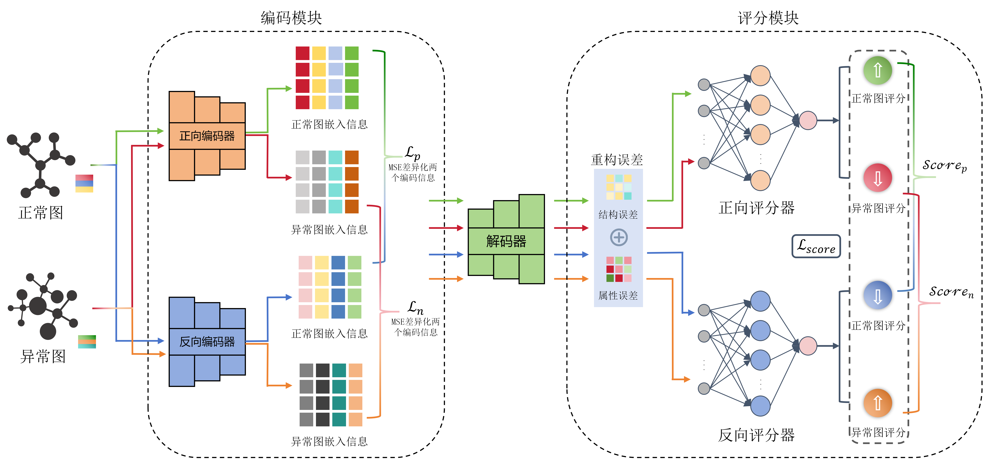

# DualGAD

The method is used for graph level anomaly detection.

## Abstract

In recent years, graph structure patterns have been widely used in data modeling in different fields. How to detect abnormal graph information from these graph data has become a hot research issue. The focus of this paper is how to use the information contained in the abnormal graphs in the data set to distinguish normal and abnormal samples. Previous studies usually assume that the proportion of abnormal graphs in the data set is extremely low, so they focus on learning the distribution pattern of normal graphs, and reconstruct the input data, using the principle that the different distribution patterns of abnormal graphs and normal graphs lead to larger reconstruction errors for anomaly discrimination. Moreover, the criterion for distinguishing anomalies is only the mean of the reconstruction errors of each node in the graph, and does not distinguish the differentiated weights of the reconstruction errors on each node. Therefore, this paper proposes a graph-level anomaly detection method based on a dual scoring learning mechanism, DualGAD (Dual scoring learning mechanism-based graph-level anomaly detection framework).The core of the model lies in the differentiated feature extraction and evaluation mechanism. The encoding module uses two encoders to perform bidirectional graph convolutional network encoding on the graph, and uses the loss function to increase the distance between the encoded feature vectors extracted by the two encoders, forcing the two encoders to generate the encoded information of the graph from different angles. The evaluation module uses two scorers to score the reconstruction error feature vectors obtained by the two encoders respectively. One scorer performs positive scoring to make the normal graph score high, and the other scorer performs negative scoring to make the abnormal graph score high. The anomaly score is calculated by combining the scoring results from the two angles, thereby effectively improving the accuracy of graph-level anomaly detection. Through comparative evaluation on 8 public graph datasets and 9 baselines, the results show that this method can efficiently and accurately detect abnormal graphs, and can overcome the performance flipping problem to a large extent while making full use of the abnormal graph information. The source code of this model is now publicly available.

## Usage

`pip install -r requirements.txt  `

`python main.py --dataset AIDS`

To change the dataset, you can change the dataset parameter, all data can be downloaded at [TUDataset | TUD Benchmark datasets (chrsmrrs.github.io)](https://chrsmrrs.github.io/datasets/)