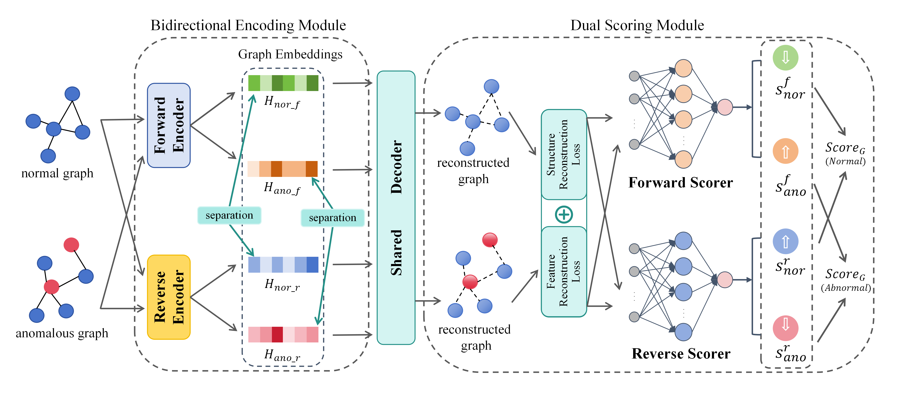

# DualGAD

The method is used for graph-level anomaly detection.

## Abstract

Graph-level anomaly detection (GLAD) aims to identify anomalous graphs within a graph set by analyzing both structural and attribute irregularities. Most existing approaches focus solely on learning normal graph patterns, which limits their ability to leverage anomaly information and often leads to performance flipping when anomaly definitions change. Moreover, these methods often rely solely on the mean reconstruction error of nodes, without considering the distinct weights of errors across dimensions. Therefore, they exhibit distinct limitations in processing complex graphs, and their evaluation criteria are too simplistic to effectively detect abnormal graphs. To overcome these limitations, we propose DualGAD, an end-to-end framework that employs a dual-scoring learning mechanism. DualGAD employs bidirectional encoders and dual scorers to extract complementary representations from normal and anomalous graphs and evaluate them from opposite perspectives, yielding balanced and robust anomaly scores. Experiments comparing nine baselines across eight datasets demonstrate that DualGAD consistently outperforms current methods, largely mitigates the performance-flipping problem, and effectively leverages anomalous graph information. The source code of this model is now publicly available.

## Usage

`pip install -r requirements.txt  `

`python main.py --dataset AIDS`

To change the dataset, you can change the dataset parameter; all data can be downloaded at [TUDataset | TUD Benchmark datasets (chrsmrrs.github.io)](https://chrsmrrs.github.io/datasets/)
